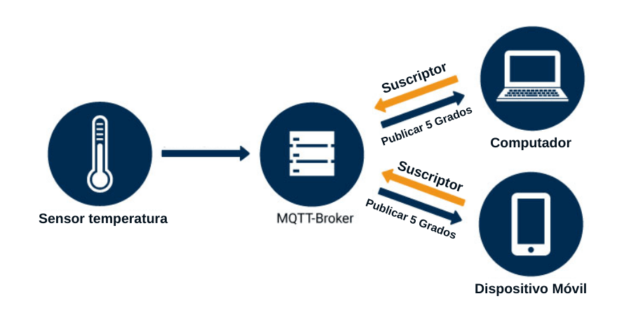

# MqttCommunicator

`MqttCommunicator` es una implementación del trait `Communicator` que publica mensajes a un broker MQTT, ideal para integración IoT y comunicación M2M (Machine-to-Machine).

## ¿Qué es MQTT?

**MQTT** (Message Queuing Telemetry Transport) es un protocolo ligero de mensajería pub/sub diseñado para:

-   Comunicación IoT
-   Redes con ancho de banda limitado
-   Dispositivos con poca energía
-  ️ Integración con servicios cloud

### Conceptos Clave



- **Broker**: Servidor central (ej: Mosquitto, HiveMQ)
- **Publisher**: Publica mensajes a topics
- **Subscriber**: Se suscribe a topics para recibir mensajes
- **Topic**: Canal jerárquico (ej: `casa/salon/temperatura`)

## Características

  **Ligero**: Overhead mínimo de protocolo  
  **QoS**: Garantías de entrega (0, 1, 2)  
  **Retained messages**: Último mensaje persiste  
  **Will messages**: Notificación de desconexión  
  **Escalable**: Miles de clientes simultáneos  

## Instalación del Broker

### Mosquitto (Recomendado)

```bash
# Raspberry Pi / Debian
sudo apt update
sudo apt install -y mosquitto mosquitto-clients

# Iniciar servicio
sudo systemctl start mosquitto
sudo systemctl enable mosquitto

# Verificar
mosquitto_sub -h localhost -t test &
mosquitto_pub -h localhost -t test -m "Hola MQTT"
```

### Configuración Básica

```bash
# Editar configuración
sudo nano /etc/mosquitto/mosquitto.conf
```

```ini
# Permitir conexiones anónimas (solo para desarrollo)
listener 1883
allow_anonymous true

# Para producción, usar autenticación:
# password_file /etc/mosquitto/passwd
# allow_anonymous false
```

```bash
# Reiniciar
sudo systemctl restart mosquitto
```

## Uso Básico

### Importar el Módulo

```rust
use lince::network::mqtt::MqttCommunicator;
use lince::core::traits::communicator::Communicator;
use lince::core::traits::communicator::CommunicatorError;
```

### Crear una Instancia

```rust
let mut mqtt = MqttCommunicator::new(
    "mi-sensor-iot",          // Client ID (único)
    "localhost",              // Broker address
    1883,                     // Puerto (1883 = sin TLS)
    "sensores/temperatura"    // Topic
)?;
```

### Enviar Mensajes

```rust
// Texto simple
mqtt.send(b"24.5")?;

// JSON
let json = r#"{"temp": 24.5, "hum": 60.0}"#;
mqtt.send(json.as_bytes())?;

```
## Uso de `sleep` al enviar mensajes MQTT

Cuando se lanza un hilo que maneja la conexión MQTT internamente, como en `MqttCommunicator`, puede ser necesario añadir pausas (`sleep`) entre envíos por estas razones:

- El hilo que procesa la conexión necesita **tiempo para iniciar y estabilizarse** antes de que se envíen los mensajes.  
- Enviar varios mensajes **muy rápido** puede provocar que algunos paquetes no se procesen correctamente si la cola interna del cliente MQTT aún no ha sido vaciada.  
- Una pequeña pausa asegura que cada mensaje llegue al broker y que el hilo de conexión tenga tiempo de manejar confirmaciones (ACKs) o notificaciones internas.

Ejemplo:

```rust
mqtt.send(b"mensaje 1")?;
thread::sleep(Duration::from_secs(1)); // Pausa para que el hilo procese la conexión

## Ejemplo

###  Publicar Lecturas de Sensor

```rust
use std::thread;
use std::time::Duration;

fn main() {
    let mut sensor = Dht22Sensor::new(23)
        .expect("Error al inicializar DHT22");
    
    let mut mqtt = MqttCommunicator::new(
        "dht22-sensor",
        "localhost",
        1883,
        "home/living-room/climate"
    ).expect("Error al conectar MQTT");
    
    println!("  Publicando datos cada 10 segundos...\n");
    
    loop {
        match sensor.read() {
            Ok(SensorOutput::Text(data)) => {
                println!("  Enviando: {}", data);
                if let Err(e) = mqtt.send(data.as_bytes()) {
                    eprintln!("  Error MQTT: {:?}", e);
                }
            }
            Ok(_) => (),
            Err(e) => eprintln!("  Error sensor: {:?}", e),
        }

        thread::sleep(Duration::from_secs(10));
    }
}
```

## Referencia de Interfaces

### `MqttCommunicator`

#### Constructor

```rust
pub fn new(
    client_id: &str,
    broker: &str,
    port: u16,
    topic: &str
) -> Result<Self, CommunicatorError>
```

Crea una nueva instancia del comunicador MQTT.

**Parámetros:**
- `client_id`: Identificador único del cliente (debe ser único en el broker)
- `broker`: Dirección del broker MQTT (hostname o IP)
- `port`: Puerto del broker (típicamente 1883 sin TLS, 8883 con TLS)
- `topic`: Topic donde se publicarán los mensajes

**Retorna:**
- `Ok(MqttCommunicator)`: Cliente conectado
- `Err(CommunicatorError::SendError)`: Error de conexión

**Ejemplo:**
```rust
let mqtt = MqttCommunicator::new(
    "sensor-kitchen",
    "192.168.1.100",
    1883,
    "home/kitchen/temperature"
)?;
```

#### Trait `Communicator`

##### `send()`

```rust
fn send(&mut self, data: &[u8]) -> Result<(), CommunicatorError>
```

Publica un mensaje al topic configurado.

**Parámetros:**
- `data`: Bytes a publicar

**Retorna:**
- `Ok(())`: Mensaje publicado exitosamente
- `Err(CommunicatorError::SendError)`: Error al publicar

**QoS**: Usa `QoS::AtLeastOnce` por defecto.

## Jerarquía de Topics

### Buenas Prácticas

```rust
//   BIEN: Jerárquico y descriptivo
"home/living-room/temperature"
"sensors/outdoor/humidity"
"devices/gateway-01/status"
"alerts/fire/zone-a"

//   MAL: Plano y ambiguo
"temp"
"sensor1"
"data"
```


## Solución de Problemas

### Error: `SendError`

**Causas:**
1. Broker no accesible
2. Puerto incorrecto
3. Client ID duplicado

**Diagnóstico:**

```bash
# Verificar que el broker está corriendo
sudo systemctl status mosquitto

# Probar conexión manual
mosquitto_sub -h localhost -t test -v

# Ver logs del broker
sudo tail -f /var/log/mosquitto/mosquitto.log
```

### Mensajes No Llegan

**Verificar:**

```bash
# Terminal 1: Suscribirse
mosquitto_sub -h localhost -t "sensors/#" -v

# Terminal 2: Publicar desde tu app
# Deberías ver los mensajes en Terminal 1
```

## Monitoreo y Debugging

### Ver Mensajes en Tiempo Real

```bash
# Todos los mensajes
mosquitto_sub -h localhost -t "#" -v

# Topic específico
mosquitto_sub -h localhost -t "sensors/temperature" -v

# Con timestamps
mosquitto_sub -h localhost -t "#" -v -F "%I %t %p"
```

### Límites Típicos

```
Mosquitto (single instance):
- Clientes: ~100,000 conexiones simultáneas
- Mensajes: ~100,000 mensajes/segundo
- Topics: Ilimitados (limitado por memoria)
```

## Recursos Adicionales

- [MQTT.org - Especificación oficial](https://mqtt.org/)
- [Eclipse Mosquitto](https://mosquitto.org/)

## Próximos Pasos

-   Aprende a [crear communicators personalizados](./custom_communicators.md)

## Ver También

- [Trait Communicator](../reference/traits_communicator.md)