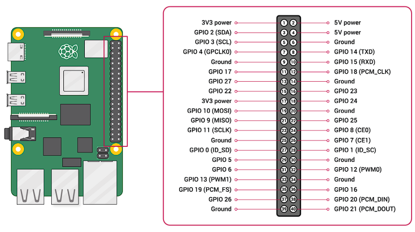

# GPIO

El `GpioDriver` proporciona una abstracción segura y de alto nivel para acceder a los pines GPIO de Raspberry Pi.

## ¿Qué es GpioDriver?

`GpioDriver` es un wrapper alrededor de `rppal::gpio` que:

-   Simplifica el acceso a GPIO
-   Implementa traits de `embedded-hal`
-   Maneja errores de forma segura

## Estructura

```rust
use rppal::gpio::{Gpio, IoPin, Mode, Level};

pub struct GpioDriver {
    pin: IoPin,
    pin_number: u8,
}
```

## GpioDriver Básico

### Constructor

```rust
impl GpioDriver {
    pub fn new(pin_number: u8) -> Result<Self, SensorError>
}
```

Crea un nuevo driver para el pin especificado (numeración BCM).

**Parámetros:**
- `pin_number`: Número GPIO (0-27 en RPi)

**Retorna:**
- `Ok(GpioDriver)`: Pin inicializado
- `Err(SensorError::IoError)`: Error al acceder al GPIO

**Ejemplo:**
```rust
use lince::drivers::gpio::GpioDriver;

let mut pin = GpioDriver::new(17)?;  // GPIO 17
```

### Lectura

```rust
pub fn read_level(&self) -> Level
pub fn read_bool(&self) -> bool
```

Lee el estado actual del pin.

**Ejemplo:**
```rust
let level = pin.read_level();
match level {
    Level::High => println!("PIN está en HIGH (3.3V)"),
    Level::Low => println!("PIN está en LOW (0V)"),
}

// O simplificado
if pin.read_bool() {
    println!("HIGH");
} else {
    println!("LOW");
}
```

### Escritura

```rust
pub fn set_high(&mut self) -> Result<(), core::convert::Infallible>
pub fn set_low(&mut self) -> Result<(), core::convert::Infallible>
pub fn write_level(&mut self, level: Level)
```

Establece el estado del pin.

**Ejemplo:**
```rust
pin.set_high()?;  // 3.3V
std::thread::sleep(std::time::Duration::from_secs(1));
pin.set_low()?;   // 0V

// O con Level
pin.write_level(Level::High);
```

### Configuración

```rust
pub fn set_mode(&mut self, mode: Mode)
```

Configura el modo del pin.

**Modos disponibles:**
- `Mode::Input` - Entrada (para leer sensores)
- `Mode::Output` - Salida (para controlar LEDs, relés)
- `Mode::Alt0` - Alt function 0 (I2C, SPI, etc.)

**Ejemplo:**
```rust
use rppal::gpio::Mode;

// Configurar como entrada
pin.set_mode(Mode::Input);

// Configurar como salida
pin.set_mode(Mode::Output);
```


## Compatibilidad con embedded-hal

`GpioDriver` implementa los traits estándar de `embedded-hal`:

```rust
use embedded_hal::digital::v2::{InputPin, OutputPin};

impl InputPin for GpioDriver {
    type Error = core::convert::Infallible;
    
    fn is_high(&self) -> Result<bool, Self::Error> {
        Ok(self.pin.is_high())
    }
    
    fn is_low(&self) -> Result<bool, Self::Error> {
        Ok(self.pin.is_low())
    }
}

impl OutputPin for GpioDriver {
    type Error = core::convert::Infallible;
    
    fn set_low(&mut self) -> Result<(), Self::Error> {
        self.pin.set_low();
        Ok(())
    }
    
    fn set_high(&mut self) -> Result<(), Self::Error> {
        self.pin.set_high();
        Ok(())
    }
}
```

**Ventaja:** Puedes usar GpioDriver con librerías que esperan `embedded-hal`.

## GPIO en Raspberry Pi



**El framework usa numeración BCM.**

### Pines Seguros para Uso General

```
Seguros:
GPIO 5, 6, 12, 13, 16, 17, 18, 19,
20, 21, 22, 23, 24, 25, 26, 27

Con precaución:
GPIO 4  - OneWire
GPIO 14–15 - UART
GPIO 2–3 - I2C
GPIO 7–11 - SPI

Evitar:
GPIO 0–1 - Reservados (ID EEPROM)

```

## Especificaciones Eléctricas

### Voltajes

- **Lógica**: 3.3V (no tolerante a 5V!)
- **HIGH**: 3.3V
- **LOW**: 0V
- **Umbral**: ~1.8V

 ️ **IMPORTANTE**: Nunca conectar 5V directamente a GPIO (¡dañará la Raspberry Pi!)

## Recursos Adicionales

### Documentación

- [RPPAL Documentation](https://docs.rs/rppal/)
- [Raspberry Documentation](https://www.raspberrypi.com/documentation/computers/raspberry-pi.html)
- [Raspberry Pi GPIO Pinout](https://pinout.xyz/)

## Ver También

- [Arquitectura del Framework](../user_guide/architecture.md)