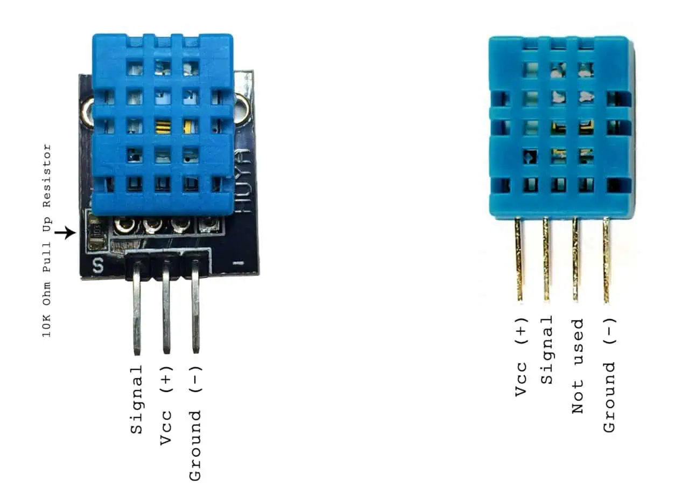

# DHT11 - Sensor de Temperatura y Humedad

El DHT11 es un sensor digital básico de temperatura y humedad, ideal para proyectos de aprendizaje y aplicaciones de bajo costo.

### Especificaciones Detalladas del Sensor

| Parámetro | Condiciones | Mínimo | Típico | Máximo |
|------------|--------------|---------|---------|---------|
| **Humedad** | | | | |
| Resolución | | 1 %RH | 1 %RH | 1 %RH |
| | 8 Bit | | | |
| Repetibilidad | | ±1 %RH | | |
| Precisión | 25 °C | ±4 %RH | | |
| | 0–50 °C | ±5 %RH | | |
| Intercambiabilidad | | Completamente intercambiable | | |
| **Rango de Medición** | | | | |
| | 0 °C | 30 %RH | – | 90 %RH |
| | 25 °C | 20 %RH | – | 90 %RH |
| | 50 °C | 20 %RH | – | 80 %RH |
| **Tiempo de Respuesta (1/e 63%)** | 25 °C, flujo de aire 1 m/s | 6 s | 10 s | 15 s |
| Histéresis | | ±1 %RH | | |
| Estabilidad a Largo Plazo | | ±1 %RH/año | | |
| **Temperatura** | | | | |
| Resolución | | 1 °C | 1 °C | 1 °C |
| | 8 Bit | 8 Bit | 8 Bit | 8 Bit |
| Repetibilidad | | ±1 °C | | |
| Precisión | | ±1 °C | ±2 °C | |
| Rango de Medición | | 0 °C | – | 50 °C |
| **Tiempo de Respuesta (1/e 63%)** | | 6 s | – | 30 s |


## Conexión de Hardware

### Esquema de Pines



**Nota**: Resistencia pull-up de 4.7kΩ o 10kΩ entre VCC y DATA.

## Uso Básico

### Importar el Módulo

```rust
use lince::devices::sensors::dht11::Dht11Sensor;
use lince::core::traits::sensor::Sensor;
use lince::core::{SensorOutput, SensorError};
```

### Crear una Instancia

```rust
// Crear sensor en GPIO 17
let mut sensor = Dht11Sensor::new(17)?;
```

### Leer Datos

```rust
use std::thread;
use std::time::Duration;

// Esperar estabilización
thread::sleep(Duration::from_secs(2));

match sensor.read() {
    Ok(SensorOutput::Text(data)) => {
        println!("Lectura: {}", data);
        // Salida: "Temp: 24°C, Hum: 60%"
    },
    Err(e) => eprintln!("Error: {:?}", e),
}
```

## Ejemplos

### Lectura Simple

```rust
fn main() {
    let mut sensor = Dht11Sensor::new(17)
        .expect("Error al inicializar DHT11");
    
    thread::sleep(Duration::from_secs(2));
    
    for i in 1..=5 {
        println!("\n  Lectura #{}", i);
        
        match sensor.read() {
            Ok(data) => println!(" {:?}", data),
            Err(e) => eprintln!(" {:?}", e),
        }
        
        thread::sleep(Duration::from_secs(3));
    }
}
```


### `Dht11Sensor`

#### Constructor

```rust
pub fn new(pin: u8) -> Result<Self, SensorError>
```

Crea una nueva instancia del sensor DHT11.

**Parámetros:**
- `pin`: Número del pin GPIO (numeración BCM)

**Retorna:**
- `Ok(Dht11Sensor)`: Sensor inicializado
- `Err(SensorError::IoError)`: Error al acceder al GPIO

**Ejemplo:**
```rust
let sensor = Dht11Sensor::new(17)?;
```

#### Método `read()`

```rust
fn read(&mut self) -> Result<SensorOutput, SensorError>
```

Lee temperatura y humedad del sensor.

**Retorna:**
- `Ok(SensorOutput::Text)`: Lectura formateada
- `Err(SensorError)`: Error durante la lectura

**Formato de salida:**
```
"Temp: 24°C, Hum: 60%"
```

**Errores posibles:**
- `SensorError::Timeout`: No hay respuesta del sensor
- `SensorError::InvalidData`: Checksum inválido


## Notas Técnicas

### Protocolo de Comunicación

El DHT11 usa el mismo protocolo que el DHT22:

1. **Inicio**: MCU pone DATA en LOW por 18ms
2. **Respuesta**: Sensor responde con pulso
3. **Datos**: 40 bits (5 bytes):
   - Byte 0: Humedad (parte entera)
   - Byte 1: Humedad (decimal, siempre 0 en DHT11)
   - Byte 2: Temperatura (parte entera)
   - Byte 3: Temperatura (decimal, siempre 0 en DHT11)
   - Byte 4: Checksum

### Formato de Datos

```
DHT11: Solo usa parte entera

Humedad:    [60] [00]  →  60%
Temperatura: [24] [00]  →  24°C
Checksum:    [84]       →  60+0+24+0 = 84

```

### Limitaciones

- Solo mide temperaturas **entre 0°C y 50°C**  
- No admite valores negativos  
- Precisión baja: **±2°C** en temperatura y **±5% RH** en humedad  
- Rango útil de humedad: **20% a 90% RH**  
- Tiempo mínimo entre lecturas: **1 segundo**  
- Usa un protocolo **de una sola línea (1-Wire propietario)**  
- Requiere resistencia **pull-up de 10 kΩ** en el pin de datos


## Recursos Adicionales

- [Datasheet DHT11](https://www.mouser.com/datasheet/2/758/DHT11-Technical-Data-Sheet-Translated-Version-1143054.pdf)


## Ver También

- [DHT22 Reference](./dht22.md)
- [DS18B20 Reference](./ds18b20.md)