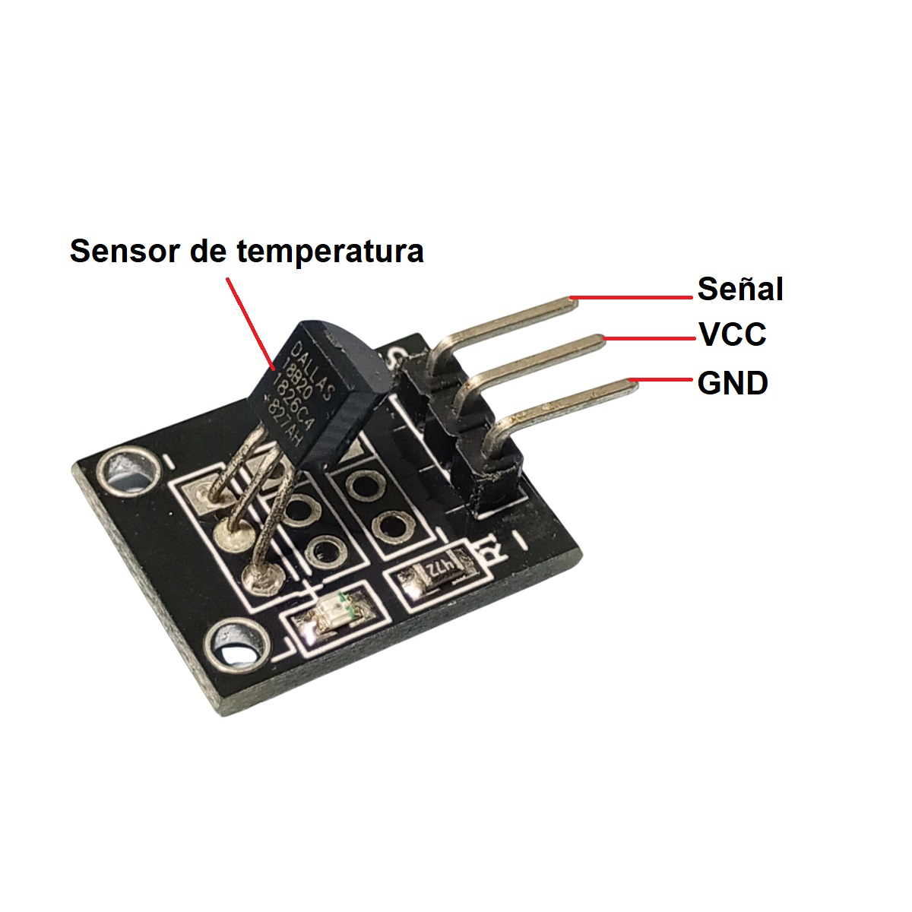

# DS18B20 - Sensor de Temperatura OneWire

El DS18B20 es un sensor digital de temperatura de alta precisión que utiliza el protocolo OneWire, permitiendo conectar múltiples sensores en un solo pin.

## Características

| PARAMETER | SYMBOL | CONDITIONS | MIN | TYP | MAX | UNITS |
|------------|--------------|---------|---------|---------|---------|---------|
| **Supply Voltage** | VDD | Local power (Note 1) | +3.0 | | +5.5 | V |
| **Pullup Supply Voltage** | VPU | Parasite power (Notes 1, 2) | +3.0 | | +5.5 | V |
| | | Local power | +3.0 | | VDD | V |
| **Thermometer Error** | TERR | -10°C to +85°C (Note 3) | | | ±0.5 | °C |
| | | -30°C to +100°C | | | ±1 | °C |
| | | -55°C to +125°C | | | ±2 | °C |
| **Input Logic-Low** | VIL | (Notes 1, 4, 5) | -0.3 | | +0.8 | V |
| **Input Logic-High** | VIH | Local power (Notes 1, 6) | +2.2 | | The lower of 5.5 or VDD + 0.3 | V |
| | | Parasite power | +3.0 | | | V |
| **Sink Current** | IL | VI/O = 0.4V | 4.0 | | | mA |
| **Standby Current** | IDDS | (Notes 7, 8) | | 750 | 1000 | nA |
| **Active Current** | IDD | VDD = 5V (Note 9) | | 1 | 1.5 | mA |
| **DQ Input Current** | IDQ | (Note 10) | | 5 | | µA |
| **Drift** | | (Note 11) | | | ±0.2 | °C |


## Conexión de Hardware

### Esquema de Pines



**Nota**: Se recomienda una resistencia pull-up de 4.7kΩ entre VCC y DATA si se usa sin .

## Configuración en Raspberry Pi

### 1. Habilitar OneWire

Editar `/boot/config.txt`:

```bash
sudo nano /boot/config.txt
```

Agregar al final:

```ini
dtoverlay=w1-gpio,gpiopin=4
```

Guardar y reiniciar:

```bash
sudo reboot
```

### 2. Cargar Módulos del Kernel

```bash
sudo modprobe w1-gpio
sudo modprobe w1-therm
```

### 3. Verificar Detección

```bash
ls /sys/bus/w1/devices/
```

Deberías ver algo como:

```
28-00000a1b2c3d  28-00000e4f5a6b  w1_bus_master1
```

Los IDs que empiezan con `28-` son sensores DS18B20.

### 4. Leer Manualmente (Test)

```bash
cat /sys/bus/w1/devices/28-00000a1b2c3d/w1_slave
```

Salida:

```
a2 01 4b 46 7f ff 0c 10 1c : crc=1c YES
a2 01 4b 46 7f ff 0c 10 1c t=26125
```

`t=26125` significa 26.125°C (dividir entre 1000).

## Uso Básico

### Importar el Módulo

```rust
use lince::devices::sensors::ds18b20::Ds18b20Sensor;
use lince::core::traits::sensor::Sensor;
use lince::core::{SensorOutput, SensorError};
```

### Crear una Instancia

```rust
// Usar el ID del sensor (sin el prefijo /sys/bus/w1/devices/)
let mut sensor = Ds18b20Sensor::new("28-00000a1b2c3d")?;
```

### Leer Temperatura

```rust
match sensor.read() {
    Ok(SensorOutput::Text(temp)) => {
        println!("Temperatura: {}", temp);
        // Salida: "24.56 °C"
    },
    Err(e) => eprintln!("Error: {:?}", e),
}
```

## Ejemplos

### Lectura Simple

```rust
use std::thread;
use std::time::Duration;

fn main() {
    let mut sensor = Ds18b20Sensor::new("28-00000a1b2c3d")
        .expect("No se pudo inicializar DS18B20");
    
    println!("  Leyendo DS18B20...\n");
    
    for i in 1..=5 {
        println!("Lectura #{}", i);
        
        match sensor.read() {
            Ok(data) => println!("   {:?}", data),
            Err(e) => eprintln!("   Error: {:?}", e),
        }
        
        thread::sleep(Duration::from_secs(2));
    }
}
```


### `Ds18b20Sensor`

#### Constructor

```rust
pub fn new(device_id: &str) -> Result<Self, SensorError>
```

Crea una nueva instancia del sensor DS18B20.

**Parámetros:**
- `device_id`: ID del dispositivo OneWire (ej: `"28-00000a1b2c3d"`)

**Retorna:**
- `Ok(Ds18b20Sensor)`: Sensor inicializado
- `Err(SensorError::IoError)`: Error al acceder al archivo del sensor


### ID Único

Cada DS18B20 tiene un ID único de 64 bits:

```
Formato: FF-SSSSSSSSSSSS-CC
         │   │            │
         │   │            └─ CRC
         │   └─ Serial único (48 bits)
         └─ Código de familia (28h para DS18B20)
```


## Recursos Adicionales

- [Datasheet DS18B20](https://datasheets.maximintegrated.com/en/ds/DS18B20.pdf)
- [Habilitar OneWire en Raspberry Pi](https://www.330ohms.com/es-co/blogs/blog/como-habilitar-la-comunicacion-1-wire-en-raspberry-pi)

## Ver También

- [DHT11 Reference](./dht11.md)
- [DHT22 Reference](./dht22.md)
- [MH-RD Reference](./mhrd.md)
