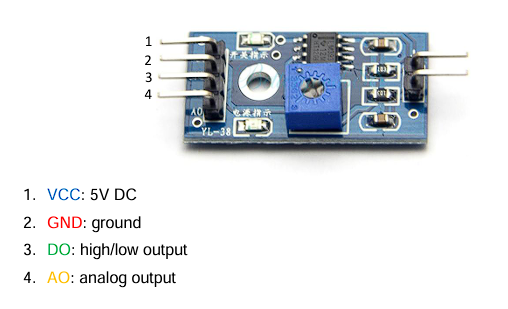

# MH-RD - Sensor de Lluvia

El MH-RD es un sensor digital de detección de lluvia que utiliza una salida digital (DO) para indicar la presencia de agua.

## Características

| Característica | Especificación |
|---------------|----------------|
| **Tipo** | Sensor de lluvia capacitivo/resistivo |
| **Salida** | Digital (DO) High/Low |
| **Voltaje** | 3.3V - 5V |
| **Lógica** | Active Low (configurable) |
| **Sensibilidad** | Ajustable mediante potenciómetro |
| **Tiempo de respuesta** | <1 segundo |
| **Aplicaciones** | Detección de lluvia, humedad superficial |

## Principio de Funcionamiento

El sensor MH-RD detecta agua mediante:

1. **Placa de detección**: Pistas conductoras que cambian resistencia con agua
2. **Comparador**: Circuito que compara resistencia con umbral ajustable
3. **Salida digital**: HIGH o LOW según presencia de agua

```
Sin agua:  Resistencia ALTA  → DO = HIGH (o LOW si active_low)
Con agua:  Resistencia BAJA  → DO = LOW  (o HIGH si active_low)
```

## Conexión de Hardware

### Esquema de Pines



### Configuración Active Low

La mayoría de módulos MH-RD son **active low**:

```
SIN LLUVIA:  DO = HIGH (3.3V)
CON LLUVIA:  DO = LOW  (0V)
```

Si tu módulo es active high, configura `active_low = false`.

## Calibración

- Girar **en sentido horario (CW)** → menos sensible (requiere más agua para activarse)  
- Girar **en sentido antihorario (CCW)** → más sensible (detecta menos agua)

**Recomendación**: Ajusta hasta que el LED del módulo encienda con unas gotas de agua.

## Uso Básico

### Importar el Módulo

```rust
use lince::devices::sensors::mhrd::MhRdSensor;
use lince::core::traits::sensor::Sensor;
use lince::core::{SensorOutput, SensorError};
```

### Crear una Instancia

```rust
// GPIO 17, active low (configuración más común)
let mut sensor = MhRdSensor::new(17, true)?;

// Si tu módulo es active high:
// let mut sensor = MhRdSensor::new(17, false)?;
```

### Leer Estado

```rust
match sensor.read() {
    Ok(SensorOutput::Text(estado)) => {
        println!("Estado: {}", estado);
        // Salida: "HÚMEDO" o "SECO"
    },
    Err(e) => eprintln!("Error: {:?}", e),
}
```

## Ejemplos

### Detector Simple

```rust
use std::thread;
use std::time::Duration;

fn main() {
    let mut sensor = MhRdSensor::new(17, true)
        .expect("Error al inicializar sensor de lluvia");
    
    println!(" Monitor de lluvia activo\n");
    
    loop {
        match sensor.read() {
            Ok(SensorOutput::Text(estado)) => {
                if estado == "HÚMEDO" {
                    println!(" ¡Está lloviendo!");
                } else {
                    println!(" Sin lluvia");
                }
            },
            Err(e) => eprintln!(" Error: {:?}", e),
        }
        
        thread::sleep(Duration::from_secs(2));
    }
}
```


## API Reference

### `MhRdSensor`

#### Constructor

```rust
pub fn new(pin: u8, active_low: bool) -> Result<Self, SensorError>
```

Crea una nueva instancia del sensor de lluvia.

**Parámetros:**
- `pin`: Número del pin GPIO (numeración BCM)
- `active_low`: 
  - `true` si el sensor es active low (DO = LOW cuando detecta agua)
  - `false` si el sensor es active high (DO = HIGH cuando detecta agua)

**Retorna:**
- `Ok(MhRdSensor)`: Sensor inicializado
- `Err(SensorError::IoError)`: Error al acceder al GPIO


## Recursos Adicionales

- [Informacion MH-RD](https://www.openhacks.com/uploadsproductos/rain_sensor_module.pdf)

## Ver También

- [DHT22 - Sensor de humedad](./dht22.md)
- [Crear sensores personalizados](./custom_sensors.md)