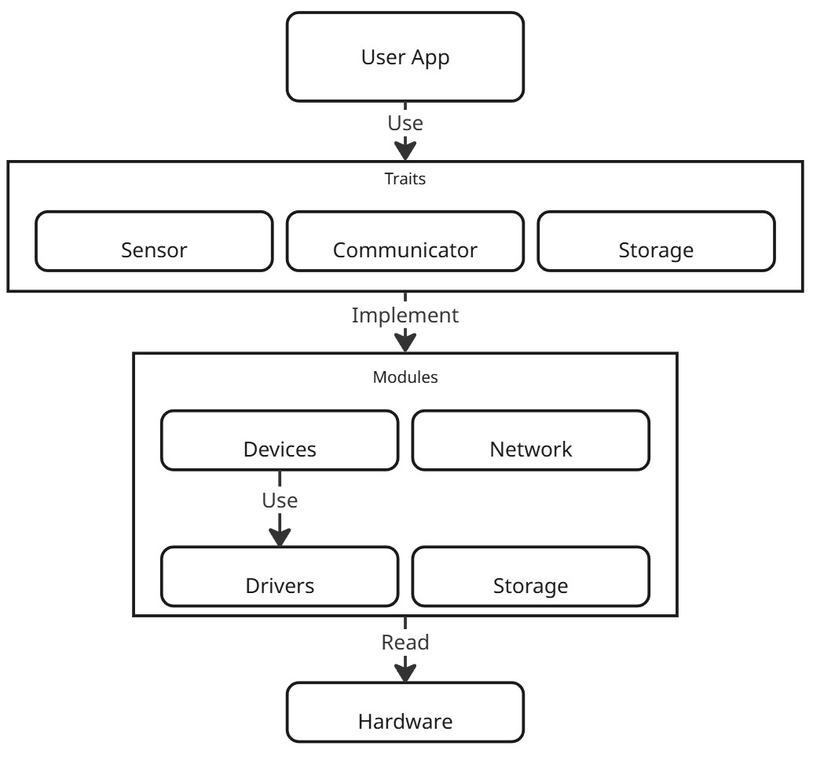
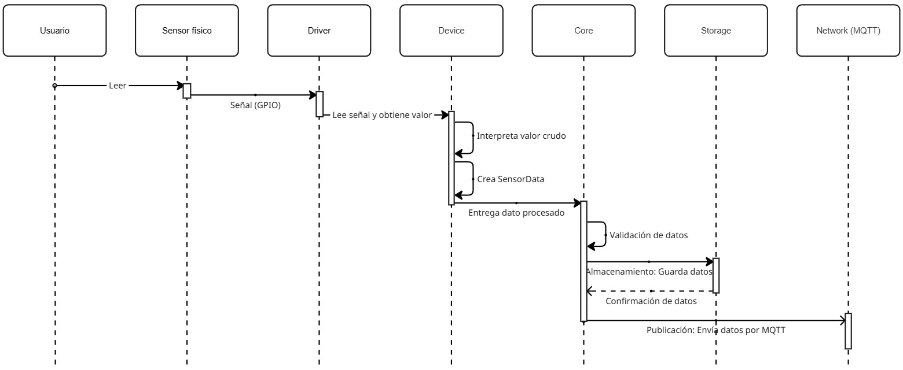

# Arquitectura del Framework

Este documento describe la arquitectura general del Framework **Lince**, sus componentes principales y cómo interactúan entre sí.

## Visión General

Lince sigue una arquitectura modular basada en **abstracciones mediante traits**, permitiendo extensibilidad sin sacrificar rendimiento.



## Componentes Principales

### 1. Core (`src/core/`)

El núcleo del framework contiene las abstracciones fundamentales.

#### Traits (`src/core/traits/`)

Define los contratos que deben cumplir las implementaciones:

```rust
// Sensor: lee datos del hardware
pub trait Sensor {
    type Output;
    fn read(&mut self) -> Result<SensorOutput, SensorError>;
}

// Storage: almacena lecturas
pub trait Storage {
    fn save(&mut self, data: SensorOutput) -> Result<(), StorageError>;
    fn list(&self) -> Result<Vec<SensorOutput>, StorageError>;
    fn clear(&mut self) -> Result<(), StorageError>;
}

// Communicator: envía datos externos
pub trait Communicator {
    fn send(&mut self, data: &[u8]) -> Result<(), CommunicatorError>;
}
```

#### Types (`src/core/types.rs`)

Define los tipos de datos compartidos:

```rust
// Representa cualquier tipo de lectura de sensor
pub enum SensorOutput {
    Bool(bool),
    Int(i64),
    Float(f32),
    Text(String),
    Bytes(Vec<u8>),
}

// Errores comunes de sensores
pub enum SensorError {
    IoError,
    Timeout,
    InvalidData,
    InitializationError,
}
```

### 2. Devices (`src/devices/`)

Implementaciones concretas de sensores físicos.

```
devices/
└── sensors/
    ├── dht11.rs      # Sensor DHT11
    ├── dht22.rs      # Sensor DHT22
    ├── ds18b20.rs    # Sensor DS18B20 (OneWire)
    └── mhrd.rs       # Sensor de lluvia MH-RD
```

**Patrón de diseño**: Cada sensor es una struct que implementa el trait `Sensor`.

```rust
pub struct Dht22Sensor {
    base: DhtBase,  // Composición: reutiliza DHT Base
}

impl Sensor for Dht22Sensor {
    type Output = SensorOutput;
    
    fn read(&mut self) -> Result<SensorOutput, SensorError> {
        // 1. Iniciar comunicación
        self.base.iniciar_secuencia()?;
        
        // 2. Leer bits
        let data = self.base.leer_bits()?;
        
        // 3. Validar integridad
        DhtBase::validar_checksum(&data)?;
        
        // 4. Interpretar datos
        let temperature = /* ... */;
        let humidity = /* ... */;
        
        Ok(SensorOutput::Text(format!(...)))
    }
}
```

### 3. Drivers (`src/drivers/`)

Capa de abstracción de hardware de bajo nivel.

```
drivers/
└── gpio.rs        # Driver GPIO genérico
```

#### GpioDriver (`gpio.rs`)

Proporciona acceso seguro a GPIO:

```rust
pub struct GpioDriver {
    pin: IoPin,         // Pin de rppal
    pin_number: u8,
}

impl GpioDriver {
    pub fn new(pin_number: u8) -> Result<Self, SensorError>
    pub fn read_level(&self) -> Level
    pub fn write_level(&mut self, level: Level)
    pub fn set_mode(&mut self, mode: Mode)
}

// Implementa traits de embedded-hal
impl InputPin for GpioDriver { /* ... */ }
impl OutputPin for GpioDriver { /* ... */ }
```

**Ventajas**:
- Compatibilidad con `embedded-hal` (estándar de Rust embebido)
- Abstracción de `rppal` específico de Raspberry Pi


### 4. Storage (`src/storage/`)

Implementaciones de almacenamiento de datos.

```rust
pub struct MemoryStorage {
    data: Vec<(SystemTime, SensorOutput)>,
}

impl Storage for MemoryStorage {
    fn save(&mut self, data: SensorOutput) -> Result<(), StorageError> {
        self.data.push((SystemTime::now(), data));
        Ok(())
    }
    
    fn list(&self) -> Result<Vec<SensorOutput>, StorageError> {
        Ok(self.data.iter().map(|(_, d)| d.clone()).collect())
    }
    
    fn clear(&mut self) -> Result<(), StorageError> {
        self.data.clear();
        Ok(())
    }
}
```

**Extensible**: Puedes crear `SqliteStorage`, `FileStorage`, etc.

### 5. Network (`src/network/`)

Implementaciones de comunicadores.

#### ConsoleCommunicator

```rust
pub struct ConsoleCommunicator;

impl Communicator for ConsoleCommunicator {
    fn send(&mut self, data: &[u8]) -> Result<(), CommunicatorError> {
        let s = String::from_utf8_lossy(data);
        println!("[CONSOLE] {}", s);
        Ok(())
    }
}
```

#### MqttCommunicator

```rust
pub struct MqttCommunicator {
    client: Client,
    topic: String,
}

impl Communicator for MqttCommunicator {
    fn send(&mut self, data: &[u8]) -> Result<(), CommunicatorError> {
        self.client
            .publish(&self.topic, QoS::AtLeastOnce, false, data)
            .map_err(|_| CommunicatorError::SendError)
    }
}
```

## Flujo de Datos

### Lectura Típica de Sensor



## Roadmap de Arquitectura

### Versión Actual
-  Traits básicos
-  Sensores DHT y DS18B20
-  Storage en memoria
-  Comunicación MQTT y consola


## Ver También

- [Conceptos Básicos](./basic_concepts.md)
- [Crear Sensores Personalizados](../sensors/custom_sensors.md)
- [Core Types](../api_reference/core_types.md)